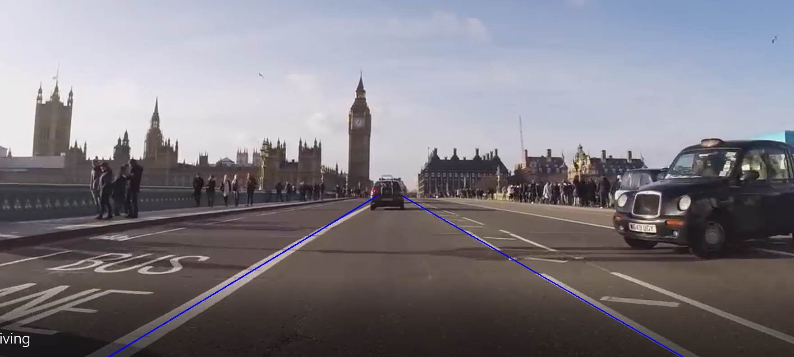

##Python Egitimi
YTU - MINT Kulubu Python Egitimi

###1. CIKTILAR: 
• Python in diger dillerden farkini ve amacini kavrama
• Python da veri tiplerini, operatorler gibi temel mimariyi kavrama
• Python da akis kontrolu, karar yapilari ve donguleri yapabilme
• Python da nesneye yonelik uygulamalar yapabilme
• Kutuphane olusturma cagirma ve yukleme yapabilme
• Github ve git araclarini giris seviyesinde kullanabilme
• Goruntu isleme alaninda giris seviyesinde uygulamalar yapabilme
###2. GEREKSINIMLER
• Dokumantasyondaki yonergeleri takip ederek VSCode ve Anaconda kurmus olmak
• Egitime ara vermeden devam etmek
• Laptop kullanmak
###3. ICERIK
**Hafta 1:**
    • Python ortami tanimi ve yapisi (VSCode, Anaconda)
    • Veri tipleri (int, float, string, boolean)
    • Operatorler (aritmetik, karsilastirma, mantiksal)
**Hafta 2:**
    • Karar ifadeleri (if-else)
    • Donguler (for-while)
    • Metotlar 
    • Algoritma uygulamalari (Fibonacci, Asal sayi, Faktoriyel)
**Hafta 3:**
    • Classlar (nesne yonelimli programlama)
    • Kutuphane olusturma, Cagirma (import)
**Hafta 4:**
    • OpenCV (Goruntu isleme)
**Hafta 5:**
    • OpenCV uygulamalari (serit tanima, renk isleme, goruntu esitleme)
    • Kapanis 
